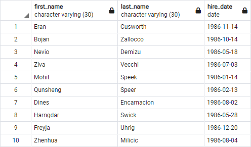
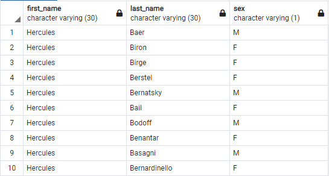
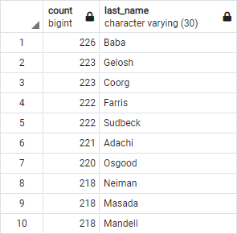
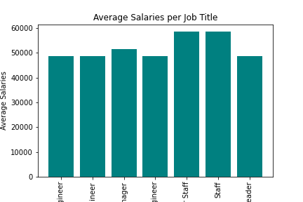

# Employee Database
---

## Introduction
This project is only special because it was done by me. Otherwise it's just another simple SQL Database 

## Files 
- schema.sql : 
Defines the schema. The tables were created to match the csvs in the data folder

- queries.sql : 
Has some simple queries that produce 

- explore_db.ipynb :  
Because I Love Jupyter notebooks

## Pictures

Some queries were done to ensure the files were loaded correctly. For example:
- The first name, last name, and hire date for employees who were hired in 1986.

- List first name, last name, and sex for employees whose first name is "Hercules" and last names begin with "B."

Very strong company! :muscle:

- In descending order, list the frequency count of employee last names, i.e., how many employees share each last name.

Then being incredibly nosy, I plotted a graph of the employee salaries. To prove that the data was fake!

See... not incredibly interesting

Thanks for visiting

:smile_cat: Nikita

